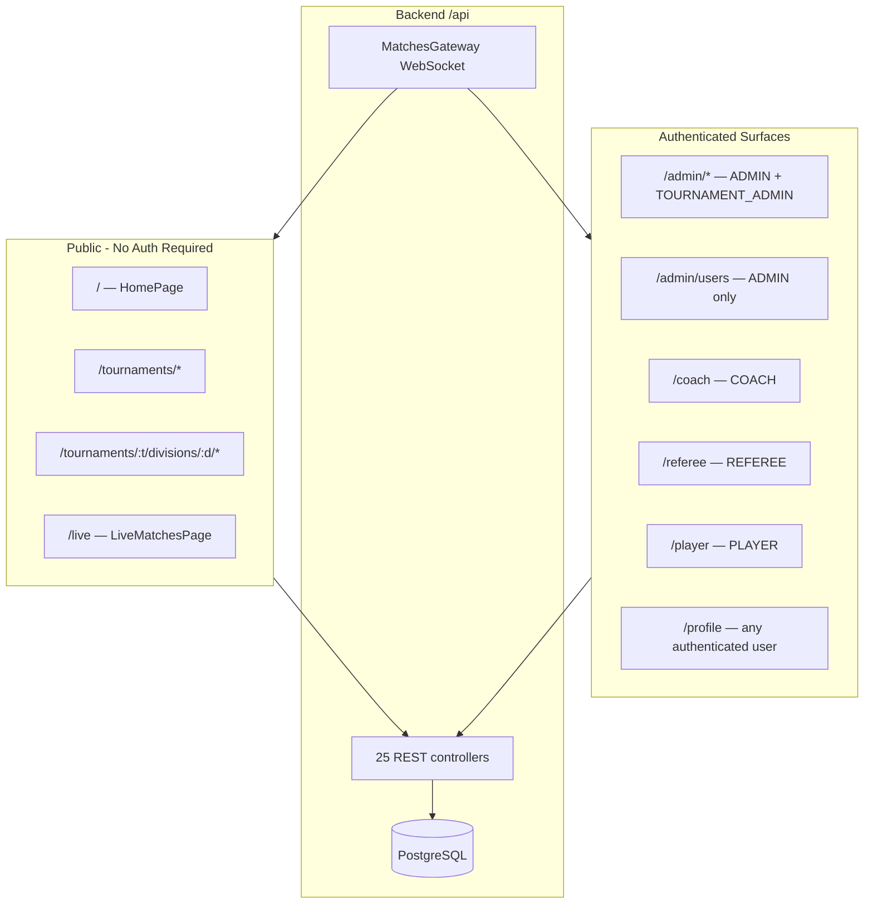
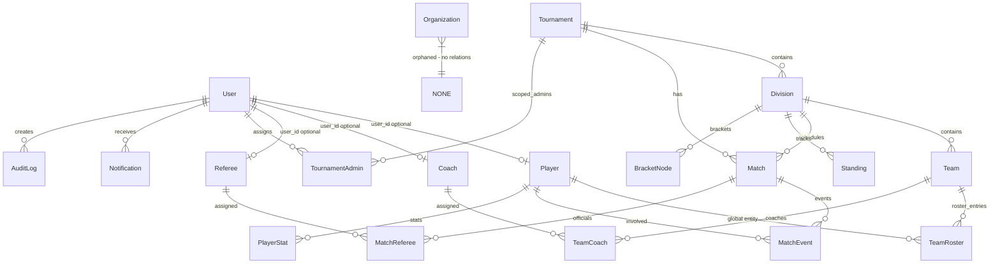
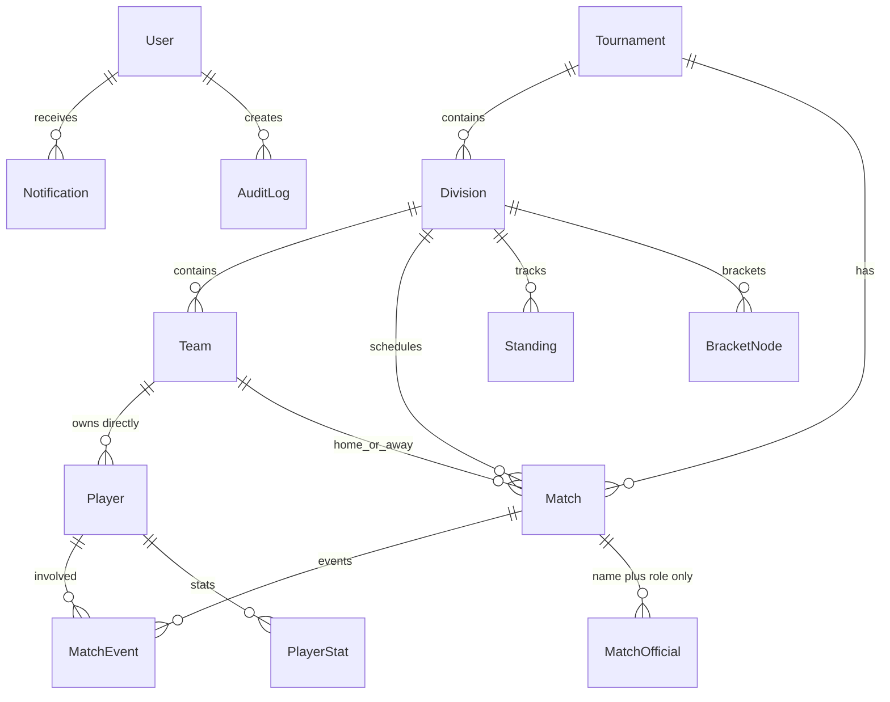
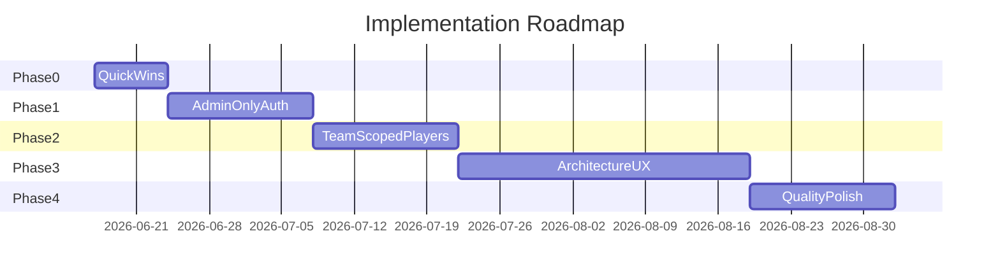
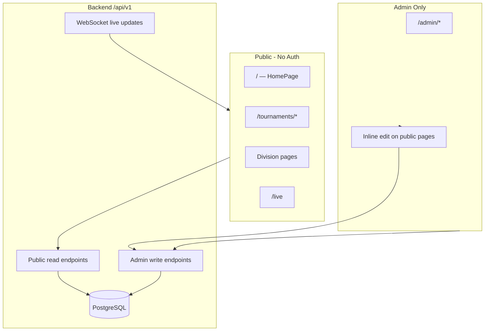

# BC Tigers — Comprehensive Refactor Plan

**Document version:** 1.0  
**Date:** June 2025  
**Status:** Architecture proposal — no code changes included  
**Audience:** Engineering team, product stakeholders

---

## 1. Executive Summary

BC Tigers is a tournament management platform built on **NestJS 11 + Prisma 7 + PostgreSQL** (backend) and **React 19 + Vite + TanStack Query** (frontend). The application successfully delivers tournament-scoped public pages, admin CRUD, live scoring via WebSocket, and division-level statistics — but accumulated complexity from **multi-role authentication**, **global player management**, **dual API surfaces**, and **duplicated admin workflows** makes the system harder to maintain and extend than necessary.

This document proposes a phased refactor that:

1. **Simplifies auth to Admin-only login** — public site stays open without authentication; remove coach, referee, player, and tournament-admin roles and their portals.
2. **Consolidates player management under teams** — players belong directly to a team; remove the global `/admin/players` page and `/api/players` CRUD.
3. **Unifies API and frontend patterns** — standardize pagination, validation, error responses, and reduce duplicate read paths.
4. **Improves UX** — especially match score discoverability (inline steppers), mobile responsiveness, and design system consistency.
5. **Reduces technical debt** — remove orphaned models, zero-test coverage gap, raw body types, and dead role infrastructure.

**Estimated total effort:** 8–12 weeks (1–2 engineers), delivered in 4 phases with rollback points after each phase.

**Confirmed scope decisions:**
- Public visitors remain unauthenticated; only staff log in as Admin.
- `/admin/players` is removed entirely; team rosters are the sole player management surface.

---

## 2. Current Architecture Findings

### 2.1 Stack Overview

| Layer | Technology | Notes |
|-------|-----------|-------|
| Backend | NestJS 11, Prisma 7, PostgreSQL | 22 feature modules, global `/api` prefix |
| Auth | JWT (passport-jwt), bcrypt | Role enum with 6 values |
| Realtime | Socket.IO (`MatchesGateway`) | Live score/event/notification broadcasts |
| Frontend | React 19, Vite 8, TypeScript 6 | Lazy-loaded routes, Zustand auth store |
| Data fetching | TanStack Query 5, Axios | Hierarchical query keys |
| Styling | Tailwind 4, Radix UI, CSS variables | Design tokens in `index.css` |
| Tests | Jest (backend configured) | **Zero test files in entire repo** |

### 2.2 Current Architecture Diagram



### 2.3 Key Architectural Patterns (Current)

**Backend:** Feature modules registered in `app.module.ts`. Admin access via `@AdminOnly()` (ADMIN + TOURNAMENT_ADMIN) and `@SuperAdminOnly()` (ADMIN only). Match mutations use `@RefereeOrAdmin()` with per-match assignment checks in `MeService.canAccessMatch()`.

**Frontend:** Layer-first organization (`pages/`, `components/`, `services/`, `hooks/`). Data flow: service → React Query hook → page/component. Tournament-scoped URL hierarchy with legacy redirect routes blocking bare `/teams`, `/divisions`, `/players`.

**Dual API surfaces:** Admin uses flat routes (`/api/divisions`, `/api/matches`, `/api/teams`). Public reads use nested routes (`/api/tournaments/:slug/divisions/:slug/*`) via `DivisionResourcesController`.

### 2.4 Findings Summary

| Area | Severity | Finding |
|------|----------|---------|
| Auth/RBAC | High | 6 user roles, 3 profile entities (Coach, Referee, Player↔User), role portals, `MeService` access logic |
| Player model | High | Global `Player` + `TeamRoster` join; duplicate CRUD in AdminPlayers vs TeamRosterPanel |
| API consistency | Medium | Mixed pagination; 13+ controllers use `Record<string, unknown>` bodies; no response envelope |
| Frontend duplication | Medium | Flat admin bulk pages vs workspace pages; score dialog reused but hidden |
| Dead code | Medium | `Organization` model with zero references; legacy player slug redirects |
| Testing | High | Zero unit/integration/e2e tests despite Jest setup |
| UX | Medium | Score updates require opening modal; native `confirm()`/`alert()` in 12+ places |

---

## 3. Domain Model Review

### 3.1 Current Entity Relationship Overview



**20 Prisma models:** User, Organization, Tournament, Division, Team, Player, TeamRoster, Coach, TeamCoach, Venue, Field, Referee, Match, MatchEvent, MatchReferee, Stage, BracketNode, Standing, PlayerStat, TournamentAdmin, Notification, Media, AuditLog, PasswordResetToken, SiteSettings.

### 3.2 Model Issues

| Model | Issue | Recommendation |
|-------|-------|----------------|
| `Organization` | No code references anywhere | **Drop table** |
| `Player` | Global entity; globally unique `slug`; optional `user_id` | Add required `team_id`; scope or remove slug |
| `TeamRoster` | Join table for team↔player when player should belong to team | **Merge into Player** after migration |
| `Coach` | Separate entity + `TeamCoach` join + User link | **Remove** — coaches become admin-managed contact on team (optional text fields) or removed entirely |
| `Referee` | Separate entity + User link + match assignment | **Simplify** — match officials as admin-managed `MatchOfficial` records (name, role) without auth |
| `TournamentAdmin` | Scoped admin role layered on UserRole enum | **Remove** — all staff are ADMIN; tournament scope becomes optional metadata if needed |
| `UserRole` | 6 values (ADMIN, TOURNAMENT_ADMIN, COACH, REFEREE, PLAYER, VIEWER) | Collapse to **ADMIN only** |
| `Notification` | Serves both user inbox and site announcements | Keep unified model; simplify inbox to admin-only after role removal |
| `SiteSettings` vs `Division` | Duplicate points rules (`points_win/draw/loss`) | Division overrides win; settings are defaults only — document clearly |
| `Media` | Exists with admin upload UI | Keep; audit usage and add CDN/storage strategy |

### 3.3 Proposed Entity Relationship Overview



**Models removed:** Organization, TeamRoster, Coach, TeamCoach, Referee, MatchReferee, TournamentAdmin.  
**Models added/simplified:** `MatchOfficial` (match_id, name, role, optional contact).  
**Models changed:** `Player.team_id` required; `User.role` enum → ADMIN only.

---

## 4. Backend Refactor Plan

### 4.1 Module Changes

| Module | Action | Reason |
|--------|--------|--------|
| `me` | **Remove** | Role-scoped match access no longer needed |
| `coaches` | **Remove** | No coach role or portal |
| `referees` | **Remove/Simplify** | Officials become match metadata, not auth entities |
| `players` | **Refactor** | Team-scoped endpoints under `teams` module |
| `auth` | **Simplify** | Remove role guards beyond AdminOnly; restrict registration |
| `users` | **Simplify** | Remove role assignment, entity linking, ensureRoleProfile |
| `matches` | **Simplify** | Replace RefereeOrAdmin with AdminOnly; remove MeService dependency |
| `notifications` | **Simplify** | Admin-only inbox; keep announcements |
| `tournaments` | **Simplify** | Remove tournament-admins controller |

### 4.2 Service Layer Improvements

1. **Introduce DTO classes** with `class-validator` for all write endpoints (currently 13+ controllers accept `Record<string, unknown>`).
2. **Extract shared Prisma includes** — `MATCH_LIST_INCLUDE` is duplicated in `matches.service.ts` and `me.service.ts`.
3. **Standardize pagination** — shared `PaginationDto` and `PaginatedResponse<T>` wrapper.
4. **Centralize slug generation** — already partially in `player-slug.ts`; extend pattern for teams/divisions.
5. **Remove `ensureRoleProfile`** (`common/ensure-role-profile.ts`) and all callers in `users.service.ts`.

### 4.3 Match Scoring Simplification

Current flow:
```
PATCH /api/matches/:id/score → RefereeOrAdmin guard → MeService.canAccessMatch()
```

Proposed:
```
PATCH /api/matches/:id/score → AdminOnly guard → direct update
```

Remove coach/referee notification fan-out tied to role profiles; optionally notify all admin users or skip per-user notifications entirely (announcements + live WebSocket sufficient for public site).

### 4.4 WebSocket Gateway

Keep `MatchesGateway` unchanged in principle. Events: `match:started`, `match:updated`, `match:event`, `notification`. After auth simplification, only admins emit; all clients subscribe.

---

## 5. Database Changes

### 5.1 Migration Plan (Ordered)

| Step | Migration | Breaking |
|------|-----------|----------|
| M1 | Add `team_id` nullable to `Player` | No |
| M2 | Backfill `team_id` from active `TeamRoster` entries (handle multi-team players — see 5.2) | No |
| M3 | Make `team_id` NOT NULL; drop `user_id` from Player | Yes |
| M4 | Drop `TeamRoster` table | Yes |
| M5 | Collapse `UserRole` to ADMIN; update all users | Yes |
| M6 | Drop `Coach`, `TeamCoach`, `Referee`, `MatchReferee`, `TournamentAdmin` | Yes |
| M7 | Create `MatchOfficial` table; migrate referee names from Referee records | No |
| M8 | Drop `Organization` table | No |
| M9 | Change `Player.slug` to `@@unique([team_id, slug])` or remove slug column | Yes |
| M10 | Add missing indexes (see 5.3) | No |

### 5.2 Multi-Team Player Migration Strategy

Some players may appear on multiple teams via `TeamRoster`. Strategy:

1. **Audit query:** `SELECT player_id, COUNT(DISTINCT team_id) FROM TeamRoster GROUP BY player_id HAVING COUNT > 1`
2. **Default rule:** Keep roster on team with most recent `joined_at`; clone player record for other teams (new UUID, same name/stats split manually if needed).
3. **Admin review UI:** One-time migration report page listing conflicts before M3 runs.

**Risk:** Low volume expected for BC Tigers; manual resolution acceptable.

### 5.3 Recommended Indexes

| Table | Index | Reason |
|-------|-------|--------|
| `Player` | `(team_id, last_name)` | Team roster listing |
| `Player` | `(team_id, slug)` | Scoped slug lookup |
| `MatchEvent` | `(match_id, minute)` | Event timeline (may exist via FK) |
| `Notification` | `(user_id, read, created_at)` | Inbox queries |
| `AuditLog` | `(entity, entity_id)` | Entity audit lookup |
| `Team` | `(division_id, name)` | Division team list |

### 5.4 Constraints to Add

- `Player.team_id` NOT NULL with ON DELETE CASCADE
- `User.role` DEFAULT 'ADMIN' (remove enum values via migration)
- Consider NOT NULL on `Match.scheduled_end` or document as intentionally optional

---

## 6. API Changes

### 6.1 Complete Endpoint Inventory (Current)

All routes prefixed with `/api`.

#### Auth — `auth.controller.ts`
| Method | Path | Guard | Notes |
|--------|------|-------|-------|
| POST | `/auth/register` | Public | Creates VIEWER by default |
| POST | `/auth/login` | Public | |
| GET | `/auth/me` | JWT | Includes player/coach/referee profiles |
| PATCH | `/auth/me` | JWT | Profile update |
| POST | `/auth/change-password` | JWT | |
| POST | `/auth/forgot-password` | Public | |
| POST | `/auth/reset-password` | Public | |

#### Tournaments — `tournaments.controller.ts`
| Method | Path | Guard |
|--------|------|-------|
| GET | `/tournaments` | Public (paginated) |
| GET | `/tournaments/by-id/:id` | AdminOnly |
| GET | `/tournaments/:slug/overview` | Public |
| GET | `/tournaments/:slug` | Public |
| POST | `/tournaments` | AdminOnly |
| PATCH | `/tournaments/:id` | AdminOnly |
| DELETE | `/tournaments/:id` | AdminOnly |

#### Tournament Admins — `tournament-admins.controller.ts` *(remove)*
| Method | Path | Guard |
|--------|------|-------|
| GET | `/tournaments/:id/admins` | AdminOnly |
| POST | `/tournaments/:id/admins` | AdminOnly |
| DELETE | `/tournaments/:id/admins/:tournamentAdminId` | AdminOnly |

#### Divisions — `divisions.controller.ts`
| Method | Path | Guard |
|--------|------|-------|
| GET | `/tournaments/:tournamentSlug/divisions` | Public |
| GET | `/tournaments/:tournamentSlug/divisions/:divisionSlug` | Public |
| GET | `/divisions` | AdminOnly |
| GET | `/divisions/by-slug/:divisionSlug` | AdminOnly |
| POST | `/divisions` | AdminOnly |
| PATCH | `/divisions/:id` | AdminOnly |
| DELETE | `/divisions/:id` | AdminOnly |
| POST | `/divisions/:id/generate-schedule` | AdminOnly |

#### Division Resources — `division-resources.controller.ts` *(public reads)*
| Method | Path | Guard |
|--------|------|-------|
| GET | `.../teams` | Public |
| GET | `.../teams/:teamSlug` | Public |
| GET | `.../teams/:teamSlug/players/:playerId` | Public |
| GET | `.../schedule` | Public |
| GET | `.../players` | Public |
| GET | `.../matches` | Public |
| GET | `.../standings` | Public |
| GET | `.../stats/top-scorers` | Public |
| GET | `.../stats/top-assists` | Public |
| GET | `.../stats/discipline` | Public |
| GET | `.../bracket` | Public |
| GET | `.../venues` | Public |
| GET | `.../venues/:venueSlug` | Public |

#### Teams — `teams.controller.ts`
| Method | Path | Guard |
|--------|------|-------|
| GET | `/teams` | AdminOnly |
| GET | `/teams/:slug` | AdminOnly |
| POST | `/teams` | AdminOnly |
| PATCH | `/teams/:id` | AdminOnly |
| DELETE | `/teams/:id` | AdminOnly |

#### Team Rosters — `team-rosters.controller.ts` *(merge into team players)*
| Method | Path | Guard |
|--------|------|-------|
| GET | `/teams/:teamId/rosters` | Public |
| POST | `/teams/:teamId/rosters` | AdminOnly |
| PATCH | `/teams/:teamId/rosters/:rosterId` | AdminOnly |
| DELETE | `/teams/:teamId/rosters/:rosterId` | AdminOnly |

#### Players — `players.controller.ts` *(remove global CRUD)*
| Method | Path | Guard |
|--------|------|-------|
| GET | `/players` | AdminOnly |
| GET | `/players/:idOrSlug` | AdminOnly |
| POST | `/players` | AdminOnly |
| PATCH | `/players/:id` | AdminOnly |
| DELETE | `/players/:id` | AdminOnly |

#### Matches — `matches.controller.ts`
| Method | Path | Guard |
|--------|------|-------|
| GET | `/matches` | AdminOnly |
| GET | `/matches/:id` | Public |
| POST | `/matches` | AdminOnly |
| PATCH | `/matches/:id` | RefereeOrAdmin |
| PATCH | `/matches/:id/score` | RefereeOrAdmin |
| POST | `/matches/:matchId/events` | RefereeOrAdmin |
| DELETE | `/matches/:id` | AdminOnly |

#### Match Referees — `match-referees.controller.ts` *(replace with MatchOfficial)*
| Method | Path | Guard |
|--------|------|-------|
| POST | `/matches/:matchId/referees` | AdminOnly |
| DELETE | `/matches/:matchId/referees/:matchRefereeId` | AdminOnly |

#### Coaches — `coaches.controller.ts` *(remove)*
| Method | Path | Guard |
|--------|------|-------|
| GET | `/coaches` | Public |
| GET | `/coaches/:id` | Public |
| POST/PATCH/DELETE | `/coaches/*` | AdminOnly |
| POST/DELETE | `/teams/:teamId/coaches/*` | AdminOnly |

#### Referees — `referees.controller.ts` *(remove)*
| Method | Path | Guard |
|--------|------|-------|
| GET | `/referees` | Public |
| GET | `/referees/:id` | Public |
| POST/PATCH/DELETE | `/referees/*` | AdminOnly |

#### Me — `me.controller.ts` *(remove)*
| Method | Path | Guard |
|--------|------|-------|
| GET | `/me/matches` | JWT |
| GET | `/me/matches/:id` | JWT |

#### Standings, Brackets, Stats, Venues, Fields, Media, Settings, Notifications, Users, Audit, Hub
*(See Appendix A for remaining endpoints — 40+ additional routes, mostly public reads + admin writes)*

### 6.2 Proposed API Changes Summary

| Current | Proposed | Action |
|---------|----------|--------|
| `/api/players/*` | `/api/teams/:teamId/players/*` | Move + scope |
| `/api/teams/:teamId/rosters/*` | `/api/teams/:teamId/players/*` | Merge |
| `/api/me/*` | — | Remove |
| `/api/coaches/*` | — | Remove |
| `/api/referees/*` | — | Remove |
| `/api/matches/:id/referees/*` | `/api/matches/:id/officials/*` | Replace |
| `/api/tournaments/:id/admins/*` | — | Remove |
| `/api/auth/register` | Admin-created accounts only | Restrict |
| `RefereeOrAdmin` on match mutations | `AdminOnly` | Simplify |
| Raw `Record<string, unknown>` bodies | Validated DTOs | Add |
| Mixed pagination | `{ data, meta: { page, limit, total } }` | Standardize |

### 6.3 Response Standardization

Proposed envelope:

```json
{
  "data": { ... },
  "meta": { "page": 1, "limit": 20, "total": 142 }
}
```

Error envelope (NestJS exception filter):

```json
{
  "statusCode": 400,
  "message": "Validation failed",
  "errors": [{ "field": "team_id", "message": "Required" }]
}
```

### 6.4 Versioning Strategy

Introduce `/api/v1` prefix when breaking changes ship (Phase 2+). Maintain `/api` as alias for 1 release cycle with deprecation headers.

---

## 7. Frontend Refactor Plan

### 7.1 Complete Route Inventory

| Path | Page | Guard | Action |
|------|------|-------|--------|
| `/` | HomePage | Public | Keep |
| `/live` | LiveMatchesPage | Public | Keep |
| `/tournaments` | TournamentsPage | Public | Keep |
| `/tournaments/:slug` | TournamentDetailPage | Public | Keep |
| `/tournaments/:t/s/divisions/:d/*` | Division pages (12 routes) | Public | Keep |
| `/matches/:matchId` | GlobalMatchRedirect | Public | Keep |
| `/login` | LoginPage | Public | Keep |
| `/register` | RegisterPage | Public | **Remove or admin-only** |
| `/forgot-password` | ForgotPasswordPage | Public | Keep |
| `/reset-password` | ResetPasswordPage | Public | Keep |
| `/profile` | ProfilePage | JWT | Simplify (admin profile only) |
| `/admin/*` | 16 admin pages | AdminOnly | Consolidate |
| `/coach` | CoachDashboard | COACH | **Remove** |
| `/referee` | RefereeDashboard | REFEREE | **Remove** |
| `/referee/matches/:id` | RefereeMatchControlPage | REFEREE | **Remove** |
| `/player` | PlayerDashboard | PLAYER | **Remove** |

### 7.2 Pages to Remove

| File | Reason |
|------|--------|
| `pages/admin/AdminPlayers.tsx` | Players managed in team rosters |
| `pages/admin/AdminCoaches.tsx` | No coach role |
| `pages/admin/AdminReferees.tsx` | Officials on match records |
| `pages/coach/CoachDashboard.tsx` | Portal removed |
| `pages/referee/RefereeDashboard.tsx` | Portal removed |
| `pages/referee/RefereeMatchControlPage.tsx` | Scoring via admin |
| `pages/player/PlayerDashboard.tsx` | Portal removed |
| `pages/auth/RegisterPage.tsx` | Public registration removed |

### 7.3 Services/Hooks to Remove or Refactor

| File | Action |
|------|--------|
| `services/players.service.ts` | Move to team-scoped methods in `teams.service.ts` |
| `services/rosters.service.ts` | Merge into teams service |
| `services/coaches.service.ts` | Remove |
| `services/referees.service.ts` | Remove |
| `services/me.service.ts` | Remove |
| `services/tournament-admins.service.ts` | Remove |
| `hooks/usePlayers.ts` | Refactor to `useTeamPlayers(teamId)` |
| `hooks/useRosters.ts` | Merge into team players hook |
| `hooks/useCoaches.ts` | Remove |
| `hooks/useReferees.ts` | Remove |
| `hooks/useTournamentAdmins.ts` | Remove |

### 7.4 Duplicate Management Flows

| Entity | Location A | Location B | Recommendation |
|--------|-----------|-----------|----------------|
| Players | AdminPlayers (global table) | TeamRosterPanel (team sheet) | **Keep B only** |
| Matches | AdminMatches (flat) | DivisionWorkspacePage (tabs) | **Keep workspace as primary**; flat page becomes filtered view or redirect |
| Teams | AdminTeams (flat) | DivisionWorkspacePage | **Keep workspace** |
| Announcements | AdminAnnouncements | HomePage inline edit | **Keep both** — public display + admin table is intentional |
| Divisions | AdminDivisions (flat) | TournamentWorkspacePage | **Keep workspace** |

### 7.5 Proposed Folder Structure (Feature-First)

```
frontend/src/
  features/
    tournaments/
    divisions/
    teams/
    matches/
    admin/
    announcements/
  shared/
    components/ui/
    hooks/
    lib/
    types/
  app/
    routes/
    App.tsx
    main.tsx
```

Migrate incrementally — do not big-bang move all files in one PR.

### 7.6 State Management

Current approach (TanStack Query + Zustand auth) is sound. Recommendations:

- Remove role-specific query keys (`queryKeys.me`, coach/referee keys)
- Add optimistic updates for score mutations
- Centralize query invalidation map (document in `query-keys.ts`)
- No additional global state library needed

---

## 8. UI & Design System Improvements

### 8.1 Current State

`frontend/src/index.css` defines a solid token system: spacing scale, shadows, z-index layers, motion durations, dark mode variables. Radix UI primitives in `components/ui/` (23 files) provide accessible dialogs, tabs, selects.

### 8.2 Gaps

| Gap | Recommendation |
|-----|----------------|
| No toast system | Add Sonner or Radix Toast; replace all `alert()` calls |
| No confirmation dialog standard | Extend `ConfirmDialog` (exists in admin inline) app-wide |
| Inconsistent page headers | Create `PageHeader` primitive (title, description, actions slot) |
| Mixed card styles | Standardize on `Card` vs `GlassCard` — document when to use each |
| Form field duplication | `form-fields.tsx` exists; ensure all admin forms use it |
| Typography | `--font-display` defined but inconsistently applied |

### 8.3 Standardization Checklist

- [ ] One button variant matrix (primary, secondary, outline, ghost, destructive)
- [ ] One table pattern (AdminTable for admin; responsive card-list for mobile public tables)
- [ ] One dialog pattern (FormDialog for CRUD; ConfirmDialog for destructive)
- [ ] One empty state component (`EmptyState` — already exists)
- [ ] One loading pattern (`QueryState` + `Skeleton` presets)
- [ ] One error display (`FormError` + toast)

---

## 9. Mobile UX Improvements

### 9.1 Known Issues

- Admin tables (`AdminTable`) use horizontal scroll on small screens but lack mobile card fallback
- Match detail hero with team circles may overflow on 320px widths
- Admin sidebar (`AdminLayout`) has mobile nav but bulk operation pages are desktop-oriented
- Touch targets on admin action buttons (`AdminActionButton size="xs"`) may be below 44px minimum
- Dialog forms with 2-column grids need single-column stack on mobile

### 9.2 Recommended Fixes

| Component | Fix | Priority |
|-----------|-----|----------|
| `AdminTable` | Add `@media` card layout mode; `<Table>` → stacked cards | High |
| `MatchDetailPage` | Reduce team circle to `h-12 w-12` on mobile; stack score vertically | High |
| `MatchScoreFormDialog` | Full-screen sheet on mobile (`Sheet` instead of `Dialog`) | Medium |
| `DivisionShell` nav pills | Horizontal scroll with snap; increase tap padding | Medium |
| `SiteHeader` | Already responsive; verify search dropdown on mobile | Low |
| All forms | `grid-cols-2` → `grid-cols-1 sm:grid-cols-2` | High |

### 9.3 Breakpoint Strategy

Use Tailwind defaults: `sm:640`, `md:768`, `lg:1024`, `xl:1280`. Document in design system: admin layouts target `md+`; public pages must work at `320px`.

---

## 10. Match Score UX Redesign

### 10.1 Current UX Problems

1. **Discoverability:** Score editing requires finding `AdminContextBar` → "Update score" button → modal dialog
2. **Friction:** 3 clicks minimum to increment score by 1
3. **Mobile:** Modal with number inputs is slow for pitch-side use
4. **Feedback:** `ScoreFlash` and `AnimatedNumber` exist for display but not tied to inline editing
5. **Duplication:** Same `MatchScoreFormDialog` used in AdminMatches, MatchDetailPage, RefereeMatchControlPage, DivisionWorkspacePage

### 10.2 Recommended Solution: Inline Stepper Controls

**Primary pattern (admin, LIVE matches):**

```
┌─────────────────────────────────────────────────┐
│  [Home Team Logo]    2  [−] [+]    1  [−] [+]   [Away Logo]  │
│                     ─────────────                               │
│                     status: LIVE                                │
└─────────────────────────────────────────────────┘
```

Implementation:
- New component: `MatchScoreStepper` in `components/matches/`
- Props: `matchId`, `homeScore`, `awayScore`, `homeTeamName`, `awayTeamName`, `disabled`
- Each +/- calls `PATCH /api/matches/:id/score` with optimistic update via TanStack Query
- Debounce or batch rapid clicks (300ms) to reduce API calls
- Show `ScoreFlash` on successful update (already wired via `useScoreFlash`)
- Loading spinner on stepper during mutation; revert on error with toast

**Secondary pattern:** Keep `MatchScoreFormDialog` as "Advanced" for status changes, bulk score entry, and non-LIVE matches.

**Mobile:** Stepper buttons minimum 48×48px; haptic feedback via CSS `:active` scale.

### 10.3 Alternative Considered

| Option | Pros | Cons | Verdict |
|--------|------|------|---------|
| Modal only (current) | Simple | Poor discoverability | Replace |
| Inline editable fields | Fast for large changes | Accidental edits | Secondary |
| +/- steppers | Fast, obvious, mobile-friendly | Many API calls | **Primary** |
| Swipe gestures | Novel | Non-discoverable, a11y issues | Reject |

### 10.4 Affected Files

- `pages/matches/MatchDetailPage.tsx` — embed stepper in hero
- `pages/admin/DivisionWorkspacePage.tsx` — quick score in matches tab
- `pages/admin/AdminMatches.tsx` — optional inline or keep dialog
- `components/admin/forms/MatchScoreFormDialog.tsx` — retain for advanced
- `hooks/useMatches.ts` — add optimistic `useUpdateMatchScoreOptimistic`

---

## 11. Security Review

### 11.1 Current State

| Area | Status | Notes |
|------|--------|-------|
| Password hashing | Good | bcrypt cost 12 |
| JWT secret | Good | Fails startup if `JWT_SECRET` missing |
| CORS | Acceptable | Configurable via `CORS_ORIGIN`; defaults include localhost + GitHub Pages |
| Registration | Risk | Open registration creates VIEWER accounts |
| Role escalation | Risk | SuperAdmin can assign any role via AdminUsers |
| Input validation | Weak | ValidationPipe enabled but most DTOs missing |
| Password reset | Good | Token expiry, single-use, generic response |
| Rate limiting | Missing | No throttling on login/forgot-password |
| Audit log | Partial | Admin actions logged; not all mutations covered |

### 11.2 Recommendations

1. **Disable public registration** — admin creates accounts via AdminUsers only
2. **Add rate limiting** — `@nestjs/throttler` on `/auth/login`, `/auth/forgot-password` (5 req/min)
3. **Add DTO validation** — all write endpoints
4. **Remove JWT role from client trust** — after Admin-only, role check is binary (authenticated admin vs public)
5. **Secrets management** — document required env vars; never commit `.env`
6. **CSP headers** — add via NestJS helmet for production
7. **Sanitize HTML** — announcements rendered on HomePage should escape user content (verify)

---

## 12. Performance Review

### 12.1 Findings

| Area | Issue | Recommendation |
|------|-------|----------------|
| Bundle size | Not measured | Run `vite build --analyze`; target < 300KB initial JS |
| Lazy loading | All pages lazy except HomePage | Good — maintain |
| React Query | Default stale times | Review `query-options.ts`; extend for static data (venues, settings) |
| Admin tables | Client-side pagination only | Acceptable for < 500 rows; server pagination for matches |
| N+1 queries | Possible in division resources | Audit Prisma includes; use `select` over `include` where possible |
| WebSocket | All clients join rooms | Scope rooms to active matches only |
| Images | No lazy loading on team logos | Add `loading="lazy"` on `` |
| Compression | Enabled on backend | Good |

### 12.2 Quick Wins

- Memoize expensive leaderboard sorts in stats pages
- Add `React.memo` to `MatchCard` in live ticker lists
- Prefetch tournament overview on hover (TanStack Query `prefetchQuery`)

---

## 13. Accessibility Review

### 13.1 Current Strengths

- Radix UI primitives provide focus traps, ARIA roles on dialogs/menus
- Some `aria-hidden` on decorative icons
- `aria-expanded` on user menu button

### 13.2 Issues

| Issue | Location | Fix |
|-------|----------|-----|
| Score steppers need labels | Match detail (proposed) | `aria-label="Increase home score"` |
| Native confirm/alert | 12+ admin pages | Replace with accessible dialogs |
| Heading hierarchy | Some pages skip levels | Audit each page: one h1, logical h2/h3 |
| Color contrast on hero | DivisionHero, SiteHeader dark variant | Verify WCAG AA on orange/white text |
| Keyboard nav on AdminTable | Row actions | Ensure tab order reaches edit/delete |
| Live ticker | Auto-updating content | `aria-live="polite"` region |

---

## 14. Technical Debt Audit

| ID | Severity | Issue | Impact | Effort | Recommendation |
|----|----------|-------|--------|--------|----------------|
| TD-01 | High | Zero test coverage | Regressions undetected | L | Add integration tests before Phase 1 |
| TD-02 | High | 6 user roles + 3 profile entities | Complex auth everywhere | L | Admin-only migration |
| TD-03 | High | Global Player + TeamRoster | Duplicate CRUD, data integrity | M | Team-scoped Player |
| TD-04 | Medium | Organization model orphaned | Schema confusion | S | Drop table |
| TD-05 | Medium | 13+ endpoints use raw body types | Invalid data in DB | M | Add DTOs |
| TD-06 | Medium | Dual API read paths | Maintenance burden | M | Consolidate over time |
| TD-07 | Medium | native confirm/alert | Poor UX, a11y | S | Toast + ConfirmDialog |
| TD-08 | Medium | Duplicate MATCH_LIST_INCLUDE | Copy-paste drift | S | Shared constant module |
| TD-09 | Low | Frontend MatchStatus missing HALFTIME/DELAYED | Type mismatch with backend | S | Sync types from Prisma |
| TD-10 | Low | Git duplicate path files (Windows) | Confusion | S | Clean untracked duplicates |
| TD-11 | Low | MeService in MatchesService | Tight coupling | M | Remove with auth simplification |
| TD-12 | Low | No API versioning | Breaking changes risky | S | Add /v1 when breaking |

---

## 15. Testing Strategy

### 15.1 Current State

- Backend: Jest + supertest configured in `package.json`; **0 spec files**
- Frontend: No test runner configured

### 15.2 Recommended Test Pyramid

| Layer | Tool | Priority Targets |
|-------|------|-----------------|
| Backend unit | Jest | Standings calculation, slug generation, schedule generation |
| Backend integration | Jest + supertest | Auth, match score update, team player CRUD |
| Frontend component | Vitest + Testing Library | MatchScoreStepper, AdminTable, QueryState |
| E2E | Playwright | Admin login → create team → add player → update score |

### 15.3 Coverage Targets (Post-Refactor)

- Backend services: 70% line coverage
- Critical paths: 100% (auth, scoring, standings recalc)
- Frontend: 50% on shared components

### 15.4 CI Integration

Add GitHub Actions workflow: lint → backend test → frontend test → build.

---

## 16. Logging & Monitoring Improvements

### 16.1 Current State

- Console.log on server start only
- AuditLog model captures admin actions (partial coverage)
- No frontend error reporting
- No performance metrics

### 16.2 Recommendations

| Area | Tool/Approach |
|------|---------------|
| API logging | NestJS Logger + structured JSON in production |
| Request tracing | Correlation ID middleware |
| Error reporting | Sentry (frontend + backend) |
| Audit completeness | Log all admin mutations (create/update/delete) |
| WebSocket monitoring | Connection count, room membership metrics |
| Analytics | Plausible or GA4 for public page views (privacy-conscious) |
| Uptime | Health check endpoint `GET /api/health` |

---

## 17. Prioritized Implementation Roadmap

### Phase 0 — Quick Wins (1 week)

| Task | Effort | Risk |
|------|--------|------|
| Drop Organization table (migration) | S | Low |
| Replace alert/confirm with ConfirmDialog + toasts | S | Low |
| Sync frontend MatchStatus type with backend | S | Low |
| Add `GET /api/health` | S | Low |
| Mobile fixes: form grids, touch targets | S | Low |
| Clean duplicate git path files | S | Low |
| Add rate limiting on auth endpoints | S | Low |

### Phase 1 — Admin-Only Auth (2 weeks)

| Task | Effort | Risk |
|------|--------|------|
| Migration: collapse UserRole to ADMIN | M | Medium |
| Remove portal routes and pages | M | Low |
| Remove MeModule, coach/referee modules | M | Medium |
| Simplify guards to AdminOnly | S | Low |
| Disable public registration | S | Low |
| Update SiteHeader, auth-utils, ProtectedRoute | M | Low |
| Integration tests for auth | M | Low |

**Rollback:** Revert migration enum; restore portal routes from git.

### Phase 2 — Team-Scoped Players (2 weeks)

| Task | Effort | Risk |
|------|--------|------|
| Migration: add team_id, backfill, drop TeamRoster | L | High |
| New team player endpoints | M | Medium |
| Refactor TeamRosterPanel → team player management | M | Low |
| Remove AdminPlayers, players.service, usePlayers | S | Low |
| Update division public player pages | M | Medium |
| Multi-team player conflict report | S | Low |

**Rollback:** Keep TeamRoster table backup; restore global endpoints.

### Phase 3 — Architecture & UX (3–4 weeks)

| Task | Effort | Risk |
|------|--------|------|
| MatchScoreStepper component | M | Low |
| API DTOs + response envelope | L | Medium |
| Consolidate admin bulk pages into workspaces | M | Low |
| Feature-first folder migration (incremental) | L | Low |
| MatchOfficial replaces MatchReferee | M | Low |
| Server-side pagination for matches | M | Low |

### Phase 4 — Quality & Polish (2 weeks)

| Task | Effort | Risk |
|------|--------|------|
| Backend test suite (critical paths) | L | Low |
| Frontend Vitest setup + component tests | M | Low |
| Playwright E2E smoke tests | M | Low |
| Bundle analysis + optimizations | M | Low |
| Accessibility audit fixes | M | Low |
| Sentry integration | S | Low |



---

## 18. Quick Wins vs Long-Term Improvements

### Quick Wins (< 1 day each)

- Drop Organization table
- Add health check endpoint
- Replace alert/confirm with dialog/toast
- Add `loading="lazy"` to images
- Fix MatchStatus type sync
- Add auth rate limiting
- Document env vars in README

### Long-Term (> 1 week)

- Admin-only auth migration
- Team-scoped player model
- Feature-first frontend restructure
- Full DTO validation layer
- Comprehensive test suite
- API versioning
- MatchScoreStepper with optimistic updates

---

## 19. Risk Assessment

| Risk | Likelihood | Impact | Mitigation |
|------|-----------|--------|------------|
| Multi-team player data loss during migration | Medium | High | Pre-migration audit report; manual review |
| Active tournament disrupted during deploy | Medium | High | Deploy in off-season; feature flags |
| Breaking public player URLs | High | Medium | 301 redirects from old slug paths |
| Admin resistance to portal removal | Low | Medium | Training; score stepper improves their UX |
| Refactor without tests causes regressions | High | High | Phase 4 tests + Phase 1 integration tests early |
| WebSocket compatibility during API changes | Low | Medium | Gateway events unchanged; version event payloads |

---

## 20. Rollback Strategy

### Per-Phase Rollback

1. **Database migrations:** Each migration has a corresponding down migration script committed alongside. Take DB snapshot before Phase 1 and Phase 2.
2. **Feature flags:** Use env var `FEATURE_ADMIN_ONLY_AUTH=true` during Phase 1 transition; old role checks remain behind flag until verified.
3. **Frontend deploy:** Static SPA on GitHub Pages — keep previous build artifact for instant rollback.
4. **API:** If `/api/v1` introduced, keep old routes active for 1 release cycle.

### Emergency Rollback Procedure

1. Revert frontend deploy to previous GitHub Pages commit
2. Revert backend deploy on Render to previous release
3. Run down migration if schema changed
4. Restore database from snapshot if data corruption detected

---

## 21. Future Scalability Recommendations

1. **Multi-organization support** — if BC Tigers expands to multiple clubs, reintroduce Organization as parent of Tournament (currently orphaned — do not add until needed).
2. **Read replicas** — Prisma supports read replicas for public division pages at scale.
3. **CDN for media** — move from local/URL storage to S3 + CloudFront.
4. **Background jobs** — standings recalculation and email notifications via BullMQ instead of inline.
5. **Public API** — if third parties need data, add read-only API keys on top of existing public endpoints.
6. **Mobile app** — current API + WebSocket architecture supports React Native client; admin-only auth simplifies mobile scope.
7. **Internationalization** — strings are inline; extract to i18n if expanding beyond English.

---

## Appendix A — Remaining API Endpoints

### Standings — `standings.controller.ts`
- `GET /standings/:divisionId` — Public
- `POST /standings/:divisionId/recalculate` — AdminOnly

### Brackets — `brackets.controller.ts`
- `GET /brackets/:divisionSlug` — Public
- `POST /brackets/:divisionId/generate` — AdminOnly
- `PATCH /brackets/nodes/:nodeId/advance` — AdminOnly
- `PATCH /brackets/nodes/:nodeId` — AdminOnly

### Stats — `stats.controller.ts`
- `GET /stats/top-scorers` — Public
- `GET /stats/top-assists` — Public
- `GET /stats/discipline` — Public
- `GET /stats/summary` — Public

### Venues — `venues.controller.ts`
- `GET /venues`, `GET /venues/:slug` — Public
- `POST/PATCH/DELETE /venues/*` — AdminOnly

### Fields — `fields.controller.ts`
- `GET /venues/:venueId/fields` — Public
- `POST/PATCH/DELETE fields/*` — AdminOnly

### Media — `media.controller.ts`
- `GET /media` — Public
- `POST /media/upload` — AdminOnly
- `DELETE /media/:id` — AdminOnly

### Settings — `settings.controller.ts`
- `GET /settings/public` — Public (site_name only)
- `GET /settings` — AdminOnly
- `PATCH /settings` — AdminOnly

### Notifications — `notifications.controller.ts`
- `GET /notifications` — JWT (user inbox)
- `GET /notifications/announcements` — AdminOnly
- `PATCH /notifications/read-all` — JWT
- `PATCH /notifications/:id/read` — JWT
- `POST/PATCH/DELETE /notifications/*` — AdminOnly (create/update/delete)

### Users — `users.controller.ts`
- `GET/PATCH/DELETE /users/*` — SuperAdminOnly
- `PATCH /users/:id/link` — SuperAdminOnly (entity linking — remove)

### Audit — `audit-log.controller.ts`
- `GET /audit-logs` — AdminOnly

### Hub — `hub.controller.ts`
- `GET /hub/home` — Public
- `GET /hub/live-matches` — Public
- `GET /hub/resolve-division/:divisionSlug` — Public
- `GET /hub/search` — Public

---

## Appendix B — Breaking Changes Checklist

- [ ] `/api/players/*` removed → use `/api/teams/:teamId/players/*`
- [ ] `/api/teams/:teamId/rosters/*` removed
- [ ] `/api/me/*` removed
- [ ] `/api/coaches/*` removed
- [ ] `/api/referees/*` removed
- [ ] `/api/tournaments/:id/admins/*` removed
- [ ] `/api/auth/register` disabled or admin-only
- [ ] `UserRole` enum values removed (only ADMIN remains)
- [ ] Match mutations require AdminOnly (no referee role)
- [ ] Frontend routes `/coach`, `/referee`, `/player` removed
- [ ] Frontend `/admin/players`, `/admin/coaches`, `/admin/referees` removed
- [ ] Player URLs change from global slug to team-scoped ID
- [ ] JWT payload role always `ADMIN` for authenticated users
- [ ] `auth/me` response no longer includes player/coach/referee profiles

---

## Appendix C — Files to Delete (Future Implementation)

### Backend
- `src/modules/me/` (entire module)
- `src/modules/coaches/` (entire module)
- `src/modules/referees/` (entire module)
- `src/common/ensure-role-profile.ts`
- `src/modules/auth/referee-or-admin.decorator.ts`
- `src/modules/tournaments/tournament-admins.controller.ts`
- `src/modules/players/players.controller.ts` (replace with team-scoped)
- `src/modules/teams/team-rosters.controller.ts` (merge)
- `src/modules/matches/match-referees.controller.ts` (replace)

### Frontend
- `src/pages/admin/AdminPlayers.tsx`
- `src/pages/admin/AdminCoaches.tsx`
- `src/pages/admin/AdminReferees.tsx`
- `src/pages/coach/CoachDashboard.tsx`
- `src/pages/referee/RefereeDashboard.tsx`
- `src/pages/referee/RefereeMatchControlPage.tsx`
- `src/pages/player/PlayerDashboard.tsx`
- `src/pages/auth/RegisterPage.tsx`
- `src/routes/portal.routes.tsx`
- `src/services/players.service.ts`
- `src/services/rosters.service.ts`
- `src/services/coaches.service.ts`
- `src/services/referees.service.ts`
- `src/services/me.service.ts`
- `src/services/tournament-admins.service.ts`
- `src/hooks/useCoaches.ts`
- `src/hooks/useReferees.ts`
- `src/hooks/useTournamentAdmins.ts`
- `src/components/admin/forms/CoachFormDialog.tsx`
- `src/components/admin/forms/RefereeFormDialog.tsx`
- `src/components/admin/forms/UserLinkDialog.tsx`
- `src/components/admin/forms/UserRoleFormDialog.tsx`
- `src/components/admin/TournamentAdminSheet.tsx`
- `src/components/admin/RefereeScheduleDrawer.tsx`
- `src/components/layouts/PortalLayout.tsx`
- `src/components/shared/PortalMatchList.tsx`

### Admin Nav Items to Remove
- Players (`/admin/players`)
- Coaches (`/admin/coaches`)
- Referees (`/admin/referees`)

---

## Appendix D — Error Handling Strategy (Unified)

### Backend
- Global exception filter returning `{ statusCode, message, errors? }`
- ValidationPipe with `forbidNonWhitelisted: true` after DTOs added
- Log 5xx errors with stack trace; sanitize 4xx for client

### Frontend
- `getApiErrorMessage()` (exists) — use everywhere
- Toast on mutation failure (replace `alert()`)
- `QueryState` for loading/error/empty trifecta on all data pages
- Retry button on network errors (already in QueryState)
- Optimistic update rollback on score stepper failure

---

## Appendix E — Forms Architecture Recommendation

Current: react-hook-form + zod schemas in `lib/schemas/admin.ts` + shared `FormDialog` + `form-fields.tsx`.

Recommendations:
1. Keep single schema file per domain (`schemas/match.ts`, `schemas/team.ts`) as forms grow
2. All forms use `FormDialog` wrapper for consistent submit/cancel/loading
3. Server validation errors map to field errors via `form.setError`
4. Mobile: full-screen sheet variant for forms with > 4 fields

---

## Appendix F — Proposed Architecture Diagram (Target State)



---

*End of refactor plan. Review and approve before beginning Phase 0 implementation.*
